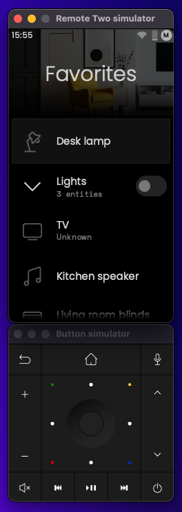

# Remote-UI

Frontend application for Remote Two written in [Qt 5](https://doc.qt.io/qt-5/qt5-intro.html) and [QML](https://doc.qt.io/qt-5/qtqml-index.html).

This application is part of the official Remote Two firmware. Custom versions can be built and installed on the device.

It also runs on desktops for local development and testing.
When run on a desktop, the app becomes a device simulator: the input buttons of the Remote Two are shown in a separate window to control the app as on a real device.

## Requirements

- Mac or Linux computer / virtual machine.
- Qt 5.15.2 (or a newer patch release) and Qt Creator.
- [Remote Two Core Simulator](https://github.com/unfoldedcircle/core-simulator) for local development.
- Docker for Remote Two Core Simulator and cross-compilation.

## Build

Use the Qt Creator IDE and open the `remote-ui.pro` project file.

A properly configured build kit for Qt 5.15.x is required. Please see our following setup guides and the official Qt documentation for more information:

- See [installation instructions](docs/install.md) on how to setup Qt on Linux.
- See [compile a static desktop remote-ui app](docs/static-compile.md) on how to setup a static Qt Kit on macOS.

The [GitHub build action](.github/workflows/build.yml) is also reference on how our automatic build works.

## Run

For local development, start the Remote Two Core Simulator and run the remote-ui app from Qt Creator.

1. Start Core Simulator docker-compose runtime
2. The application requires environment variables to pass configuration parameters:
  - `UC_TOKEN_PATH`: path to the token file containing the WebSocket Core-API access token for the Core / Simulator.
  - Add `UC_TOKEN_PATH=$CORE_SIMULATOR_PATH/docker/ui-env/ws-token` in the run environment settings.

### Environment Variables

| Variable              | Description                              | Default                |
| --------------------- | ---------------------------------------- | ---------------------- |
| UC_MODEL              | The model of the hardware                | DEV                    |
| UC_DISPLAY_WIDTH      | Width of the display                     | 480                    |
| UC_DISPLAY_HEIGHT     | Height of the display                    | 850                    |
| UC_DISPLAY_SCALE      | Scale factor for the display             | 0.5                    |
| UC_SOCKET_URL         | Websocket url of the core                | ws://127.0.0.1:8080/ws |
| UC_TOKEN_PATH         | Location of the token file from the core | None                   |
| UC_RESOURCE_PATH      | Location of the resources directory      | None                   |
| UC_SOUND_EFFECTS_PATH | Location of the sound effects directory  | None                   |

## Remote Two Cross-Compilation and Custom Installation

A custom version of the remote-ui app can be installed on the Remote-Two device.

This requires a static Qt build, since the device doesn't contain any Qt libraries. See [Cross-Compile & Installation](docs/cross-compile.md) documentation.

Please be aware, that **installing a custom remote-ui version on the Remote Two device will void your warranty!**
 
## Contributing

Please read [CONTRIBUTING.md](CONTRIBUTING.md) for details on how to contribute and submit pull requests to us.

## License

The Remote-UI is published under the [GPL v3](LICENSE) open source license.
