# Design system mockups

Five screens as the remote-ui draws them today (current) and under the [design system](../../design-system.md)
(proposed), plus a sheet with the colour tokens, type roles and selection states. The current screens are drawn
from the values in the QML sources at release v0.82.1; the [audit](../audit.md) explains the findings behind them.

The proposed screens include the designer's revision of 2026-10-07. The selected fill on the main UI is the
provisional #595959 (open question Q-3 in the design system).

Each mockup is a PNG for reading here and a standalone HTML file under [src/](src) for changing it. The HTML
files need nothing but the Poppins and Space Mono fonts installed locally ([install guide](../../install.md#fonts)).
Open one in a browser to see true colours, as on the Remote Two OLED. Add `?lcd` to the URL to approximate the
Remote 3 LCD with a raised black and a softer white; the approximation is a visual aid, not a measurement.

## Screens

| Current | Proposed |
| ------- | -------- |
| **Settings menu**: the selected row is a #161616 fill on black. 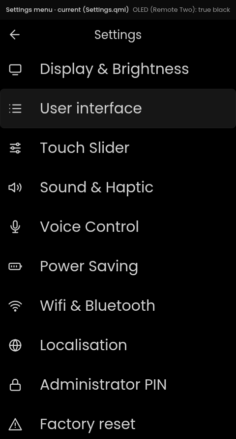 | The selected row has a 3 px ring and no fill. 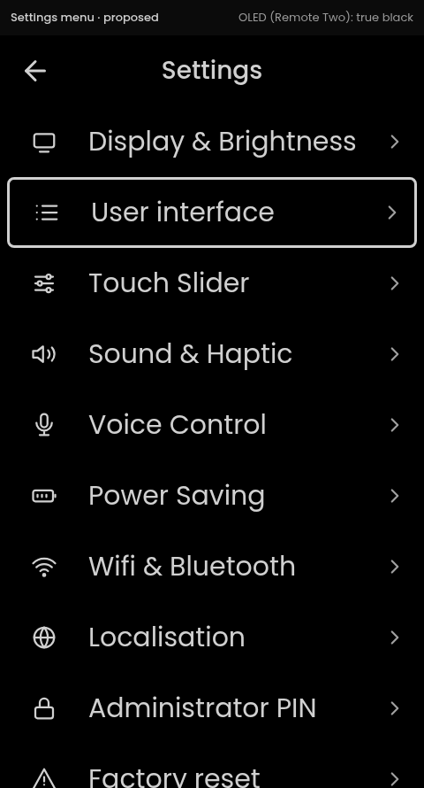 |
| **Display & Brightness**: help text in grey Space Mono 24. 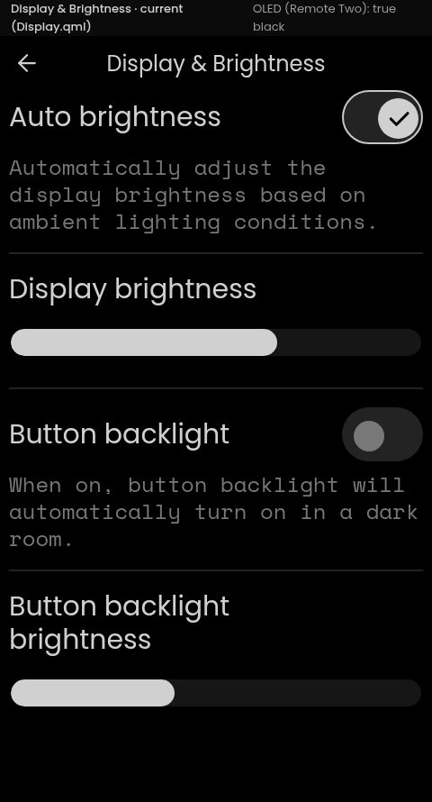 | The ring sits on the switch; help text in Poppins 26. 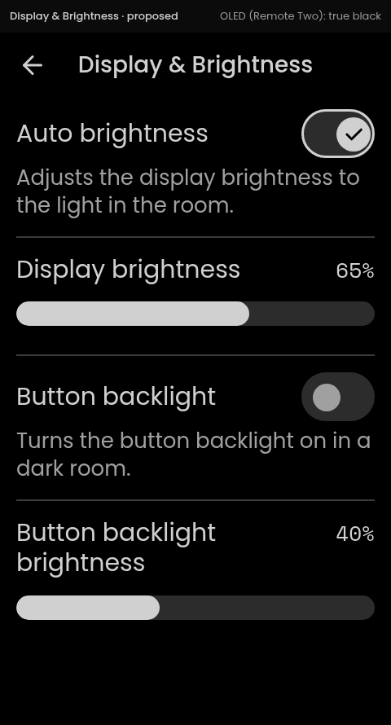 |
| **Release notes**: the body in grey Space Mono 24. 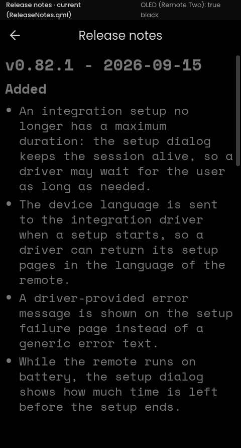 | Prose in Poppins 26, primary text colour. 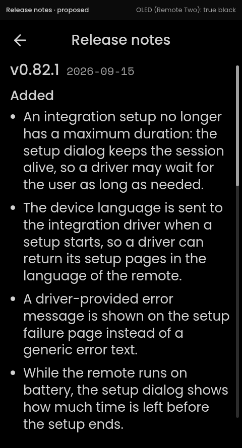 |
| **Home page**: the selected tile is an always-on #111111 fill. 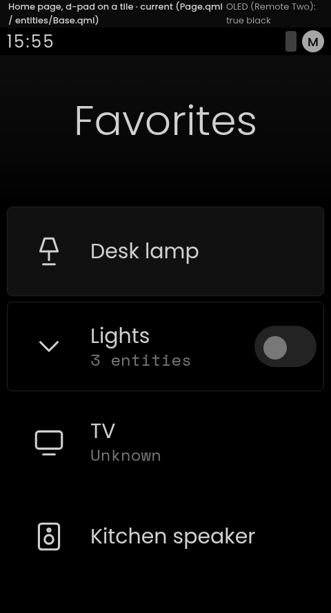 | The selected tile has the #595959 fill and no ring. 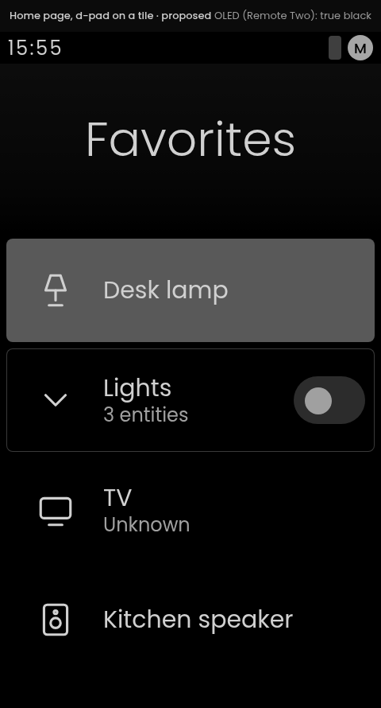 |
| **Page menu** (HOME long press): a #161616 fill on the selected row. 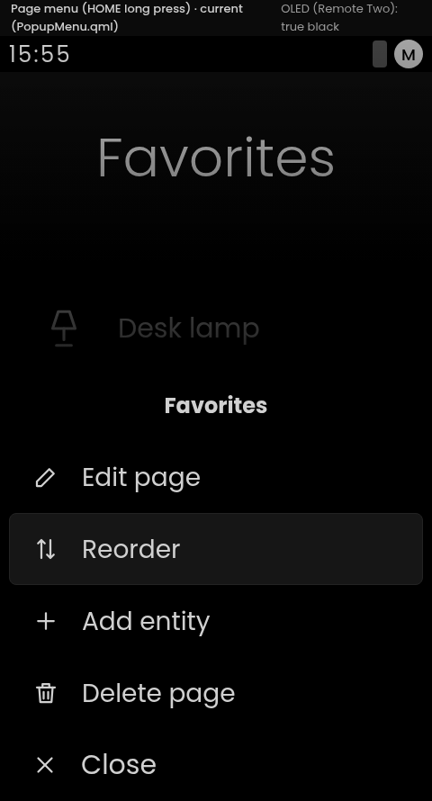 | A black sheet with a divider edge, the fill on the selected row, Close as the last row. 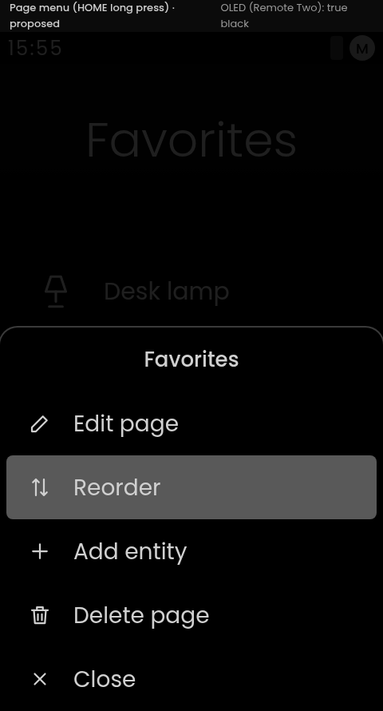 |

## Design sheet

Colour tokens, type roles, the selection and state contract with every control in its rest, selected, pressed
and disabled state, and the layout rules.

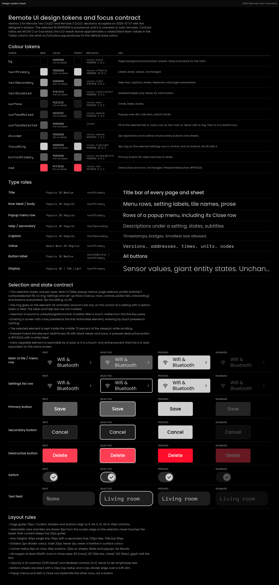

## Regenerating a PNG

After changing an HTML source, render it again with headless Chrome from this folder. The screens are
480 x 890 px (a 40 px caption above the 480 x 850 screen); the design sheet is 1600 px wide and as tall as its
content.

```bash
google-chrome --headless=new --hide-scrollbars --force-device-scale-factor=1 \
  --window-size=480,890 --screenshot=home-proposed.png "file://$PWD/src/home-proposed.html"
```
