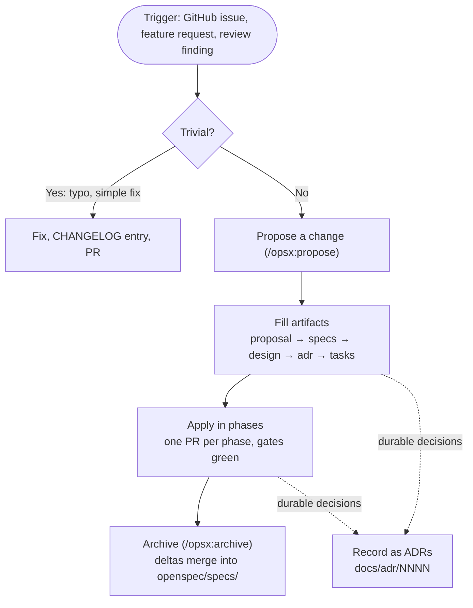

# Development workflow — plan first, then implement

This project runs a **spec-driven** workflow on [OpenSpec](https://openspec.dev): no non-trivial
change is implemented before it is written down as a _change_ that agents (and humans) build
_against_, and the durable decisions made along the way are captured as [Architecture Decision Records (ADRs)](adr/README.md).
This page is the high-level flow; the mechanics live in [openspec/README.md](../openspec/README.md)
and the forked workflow schema at `openspec/schemas/spec-driven-with-adr/`. The decision to adopt
it is [ADR 0001](adr/0001-adopt-openspec.md).

## The flow

## What is a change

A **change** under [`openspec/changes/`](../openspec/changes) is the plan for one piece of work:

- `proposal.md` — why, what changes, which capabilities are new or modified, impact, affected
  hardware models and core-version dependency.
- `specs/<capability>/spec.md` — the behavioural delta (`ADDED` / `MODIFIED` / `REMOVED`
  requirements with WHEN/THEN scenarios) against the living specs in `openspec/specs/`.
- `design.md` — how: Current State Analysis against a named commit, decisions with alternatives,
  a Failure Mode Analysis where the change touches a risky surface (input ownership / focus, the
  Core-API connection, activity sequences, power modes, the static build), the resource impact,
  and the verification target (the `DEV` simulator or a device).
- `adr.md` — the ADR review manifest: which in-force ADRs were read, which new ADRs were written.
- `tasks.md` — the phased checklist that `/opsx:apply` works through, including the file
  registration (`remote-ui.pro`, `.qrc`, test CMakeLists) and the `CHANGELOG.md` entry.

`openspec/config.yaml` injects the project conventions into every artifact, so an author does not
have to remember them.

A **trivial** fix (a typo, a one-line guard, a translation comment) does not need a change: fix it,
add the `CHANGELOG.md` entry, open the PR. When in doubt, the question "would a reviewer want to
see the intended behaviour written down before reading the diff?" decides.

## The living specs

[`openspec/specs/`](../openspec/specs) describes what the app _does_, one capability per folder
(`key-navigation`, `activities`, `core-connection`, …). It was **seeded from the shipped code** in
2026-09 (change `seed-behavioral-specs`), so it is a transcription: where a spec and the code
disagree, the code is what ships and the spec is corrected in the next change that touches it.
You do not hand-edit `openspec/specs/`; it grows and changes when a change is archived. A change
that alters shipped behaviour carries a `MODIFIED` delta for the affected capability, which makes
the behaviour change reviewable next to the code.

## Applying a change

- Complete the artifacts, then **apply** — work the `tasks.md` checklist (`/opsx:apply`). Each
  phase is an independently reviewable PR that names its files, so file-disjoint phases can run as
  parallel git-worktree agents. Every PR passes the gates: it builds (desktop and, for anything
  touching QML or hardware paths, the `make ucr2` static cross-build), `./cpplint.sh`, the unit
  tests (`make test`), and a verification on the stated target — a d-pad navigation change is
  walked with the keypad, not only tapped.
- Deviations found while implementing are fed **back into the change's artifacts** in the same PR,
  not silently coded around. When the change is finished, **archive** it (`/opsx:archive`): its spec
  deltas merge into `openspec/specs/` and the change folder moves to `openspec/changes/archive/`.
- `CHANGELOG.md` stays the user-facing record of every release; the archived change is the
  engineering record.

## Recording decisions (ADRs)

Durable decisions are captured as **Architecture Decision Records** in [docs/adr/](adr/README.md) —
one short file per decision (Context / Decision / Consequences). Write an ADR when a choice is worth
being able to find later on its own: a platform constraint (Qt 5.15, the static binary), a policy
(translations, licensing), a "we are deliberately _not_ doing X", or a pattern we chose to keep
against the obvious alternative (the input idiom rule).

The rule of thumb: a **change** describes _work to build_; an **ADR** records _a decision and its
rationale_. ADRs are **immutable** once accepted — a changed mind is a _new_ ADR whose `Supersedes:`
field names the old one; the schema's `adr` step walks those links to know what is currently in
force.

## Non-functional requirements

Resource budgets, compatibility with remote-core versions, verification obligations and similar
non-functional requirements are **decided by the maintainers, not derived from the code**. They are
the `platform-constraints` capability and, where they are policies, ADRs. What is still undecided is
named there ("Undecided non-functional requirements are not assumed"): a change that needs it asks
the maintainer in its Open Questions instead of inventing a number.

## Tooling

**Reading needs nothing** — it is all Markdown. **Authoring** needs Node 20.19+ and the OpenSpec
CLI (`npx @fission-ai/openspec@latest`). OpenSpec works with many AI coding tools — Claude Code,
Cursor, GitHub Copilot, Codex, Gemini CLI and others — and without any: `openspec init --tools
<tool>` generates the `/opsx:*` commands and skills for the tool you use (`openspec init --help`
lists them). The generated files are not tracked. See [openspec/README.md](../openspec/README.md).
Every coding agent reads [AGENTS.md](../AGENTS.md) in the repository root (`CLAUDE.md` links to
it): it lists the traps of the code base and links to the specs and ADRs that own each rule.
